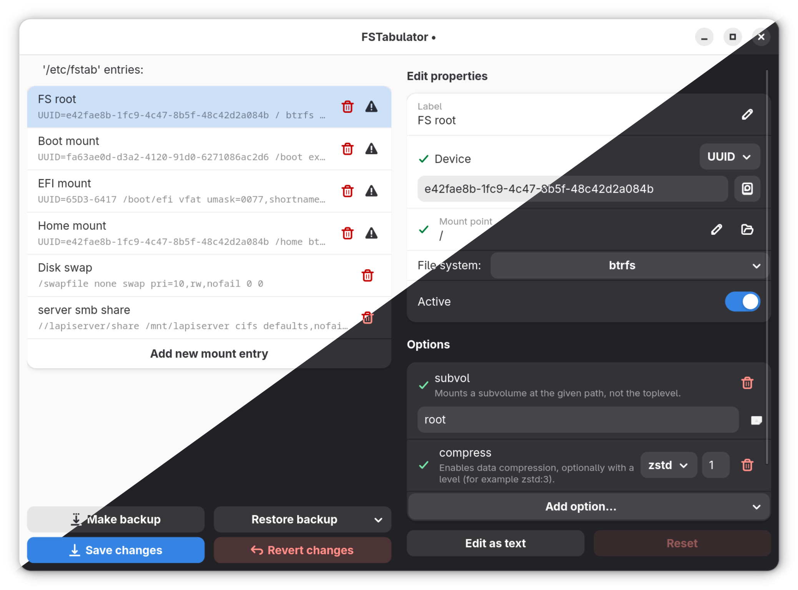
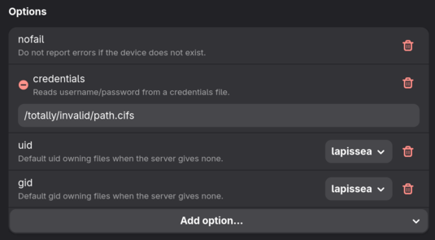
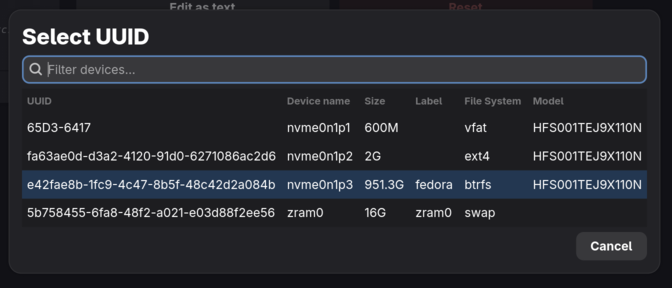
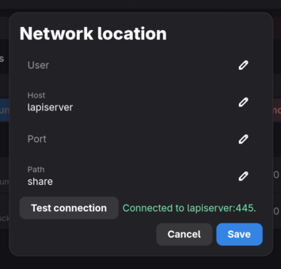
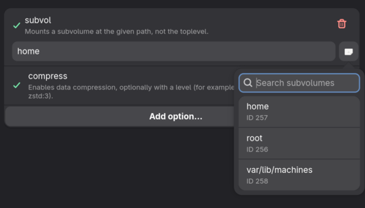
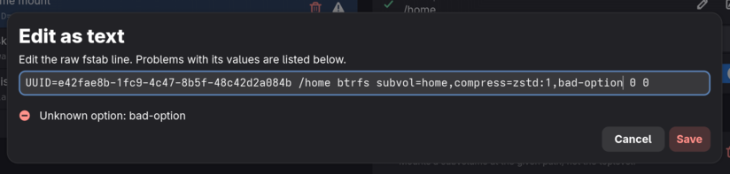
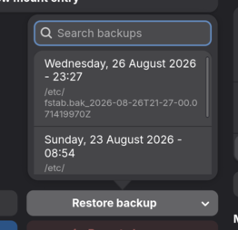

# FSTabulator


FSTabulator is a Linux GUI application for helping you permanently mount your drives, whether local or network drives.

To do that, you normally have to edit the `/etc/fstab` file by hand, which can be confusing and easy to mess up.
FSTabulator helps you do that as easily as possible by showing you what can be done, what is probably wrong and doing the
job of searching for exact info you need.
Hopefully, now you wont need to google how to find a drive you want every time you need to edit your mounts! ;)



## Main features

- You can edit (or add) your mount properties (device, mount point, filesystem type, options...) through an accessible UI form
- There is extensive (hopefully exhaustive) typed mount options for all file systems you might use with carefully designed UI that helps you configure things correctly.
  <br/>  
- Storage device picker with easy conversion between UUID, PARTUUID, LABEL, PARTLABEL to suite what you prefer
  <br/>  
- Network mounts (SMB, NFS, sshfs) with an address editor, a live connection test, and easy credential saving
  <br/>  
- Btrfs subvolume browser straight from the filesystem so you don't doubt yourself
  <br/>  
- Edit raw fstab entries with live validation (syntax errors block saving...)
  <br/>  
- Easy reverts if you messed something up and fstab backup creation
  <br/>  
- Mount, remount and unmount from the app, next to a live mounted-status indicator

## Safety first!

FsTabulator does its best to let you know when something is wrong with an entry.

It also helps you keep backups of your fstab (up to 3) and makes it easy to restore them if you ever need to do that.

## Installing

Get it from **<... uhhh not sure yet>** or,

build from source. You'll need the Rust toolchain, the GTK4 and libadwaita and other development dependencies listed below.

### Build it yourself & dependencies

First install dependencies required to build the project:

```sh
# Fedora
sudo dnf install rust cargo gcc pkgconf-pkg-config gtk4-devel libadwaita-devel gettext make

# Debian / Ubuntu
sudo apt install cargo gcc pkg-config libgtk-4-dev libadwaita-1-dev gettext make

# Arch
sudo pacman -S rust pkgconf gtk4 libadwaita gettext base-devel make
```

Then run:

```sh
cargo build --release
```

You can also run one of the rmp/deb/arch `install_to_*` scripts in the `./scripts` folder to get an installer file.

**WARNING:** _flatpak is borked until I figure out how to work with the sandbox. Maybe it does not make sense at all to have a flatpak. (sorry)_

# Translations

FSTabulator is mostly machine translated. It uses gettext. See `po/` if you would like to help!

# AI Disclosure

Parts of this project have been written with assistance from LLMs. Specifically: translations, testing, help with understanding GTK and collection of file system options and their descriptions.
I have checked what I could but there is too many file system options to realistically check all of them. It is on a best effort basis and not a 100% validated.
Where AI code has been generated, it has never been left unread, unedited or in general not validated. All code in this project is my responsibility.

I understand the issues with using LLMs and I have taken procautions to mitigate or entirely avoid them. Large closed source models like Claude or Gemeni have been used sparingly and only for
research poupurses.

This project has been a work of passion for me and a lot of decisions made have been from personal experience while using Linux.
The design is intentional and by no means slop if that is a concern.